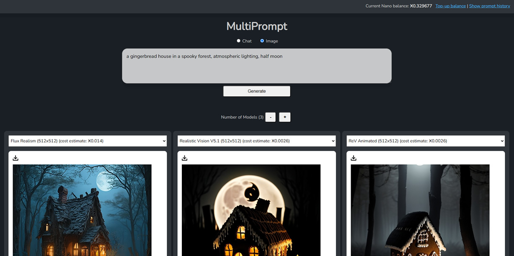
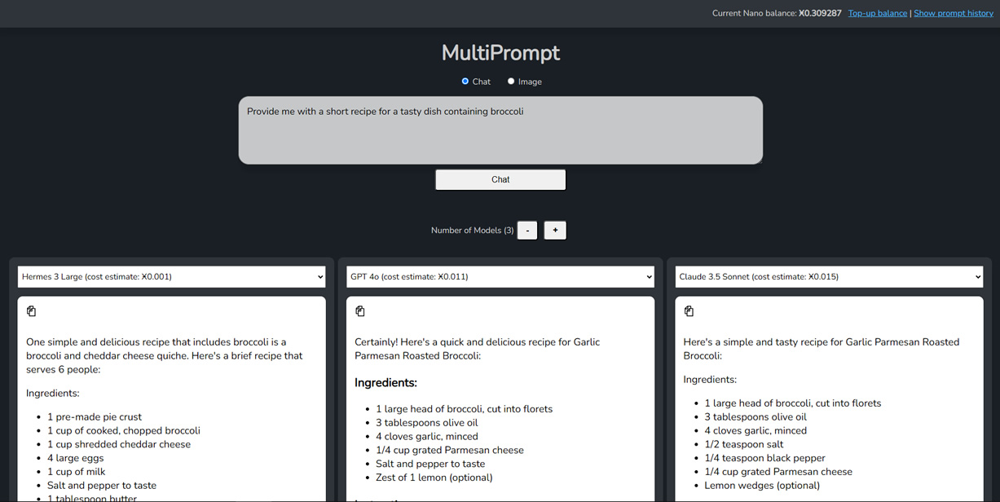

# MultiPrompt

MultiPrompt allows you to send a prompt to multiple LLMs / text models / image models simultaneously.

# How does it work?

This tool forwards your prompts to the [NanoGPT](https://nano-gpt.com) service and gathers the results for display in a side-by-side format.

It runs locally on your machine so your prompts and responses will only ever be seen by your web browser and the NanoGPT service. This is the same as if you used NanoGPT directly.

# Screenshots


*Comparing image models*


*Comparing text models*

## Prerequisites

You will need to have [Node.js](https://nodejs.org/) installed on your machine.

Also you will need an [API key](https://nano-gpt.com/api) for NanoGPT, a service that enables pay-per-prompt usage of different text and image models. You will also need to top-up your [NanoGPT wallet](https://nano-gpt.com/wallet) with any of the available payment options.

## Installing

Inside the MultiPrompt folder, via command line:

```bash
npm install
```

## Running MultiPrompt

Inside the MultiPrompt folder, via command line:

```bash
npm run multiprompt -- --open
```

Opens MultiPrompt in your web browser.

## Using MultiPrompt

You will be asked to enter your [NanoGPT API key](https://nano-gpt.com/api) before using MultiPrompt. This API key can be cleared at any time by using the 'Clear API key' link at the bottom of the page.

## License

GPLv3
